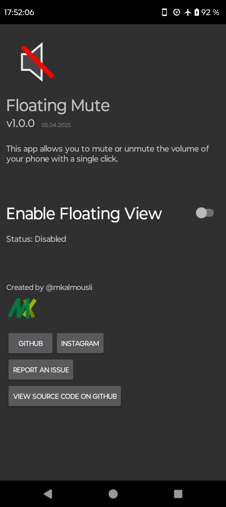
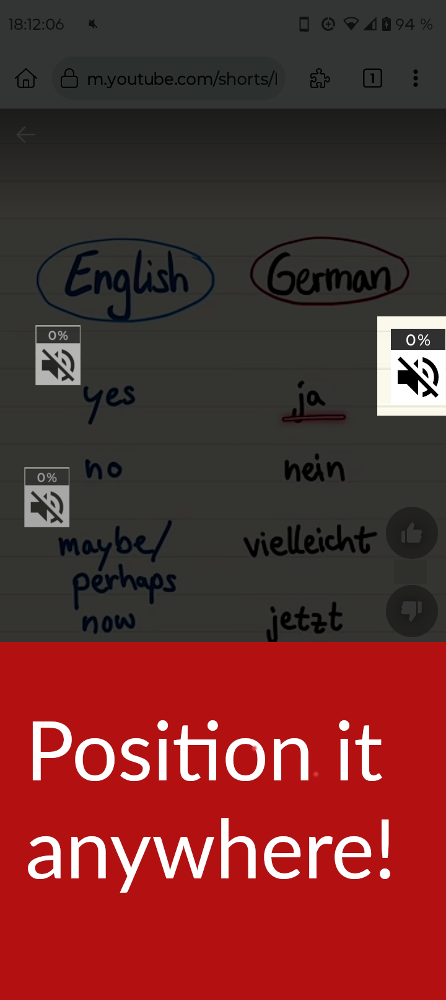
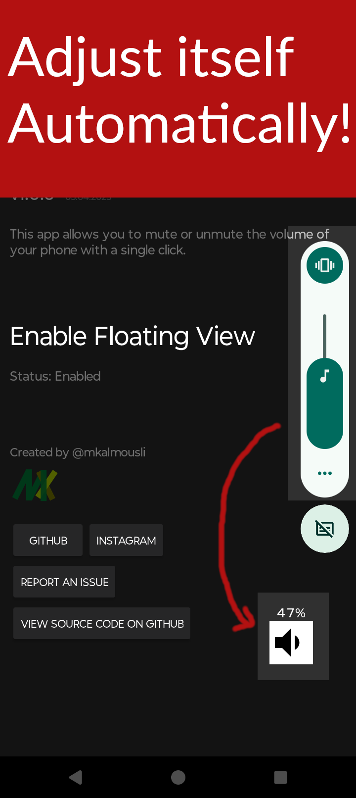
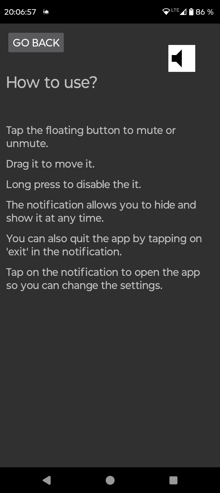

 

    

<h1 align="center">Floating Mute</h1>

    Easily switch between mute and unmute with a single tap while watching videos. Perfect for YouTube shorts, Reels, and more.

## Get it

[F-Droid](https://f-droid.org/) is the official and recommend way to get Floating Mute:

F-Droid takes a while to publish new versions, if you want to get latest version, you can get it from GitHub releases:

The app is published on these platforms, yet it might not be always up to date:
- [Uptodown](https://floating-mute.en.uptodown.com/android) (Currently v1.0.0)

- [OpenAPK](https://www.openapk.net/floating-mute/com.github.mkalmousli.floating_mute/)

- [IzzyOnDroid](https://apt.izzysoft.de/fdroid/index/apk/com.github.mkalmousli.floating_mute)

Please don't try to install it from other sources, as they might have changed the code.

## Features
- Mute/Unmute your device with a single tap.
- When unmuting it restores the volume as it was before unmuting.
- Can be placed anywhere on the screen by simply dragging it.
- You can hide it by long pressing it, and tap on the notification to make it appear again.
- It saves the position of the button on the screen for each orientations, portrait and landscape.
- Automatically adjusts itself as you change the volume.
- Shows the percentage in beside the floating button.

## Usage
- Tap the floating button to mute or unmute.
- Drag it to move it.
- Long press to hide it.
- The notification allows you to hide and show it at any time.
- You can also quit the app by tapping on 'exit' in the notification.
- Tap on the notification to open the app so you can change the settings.

## Screenshots

<table>
    <tr>
        <td>
            
            
            
            
            
        </td>
    </tr>
</table>

## Press

I appreciate the support from the tech community!

- **Floating Mute** was featured on [Computer-WD](https://www.computer-wd.com/2025/04/new-smartphone-apps.html#header-3), one of the top Arabic tech blogs:

    > *"A clever Android tool that makes muting and unmuting videos effortless—especially useful for short-form content like YouTube Shorts and Reels."*  
    > *(Translated from Arabic)*  
    > — April 11, 2025

## License
  

Floating Mute is Free Software: You can use, study, share, and improve it at will. Specifically you can redistribute and/or modify it under the terms of the [GNU General Public License](https://www.gnu.org/licenses/gpl.html) as published by the Free Software Foundation, either version 3 of the License, or (at your option) any later version.
