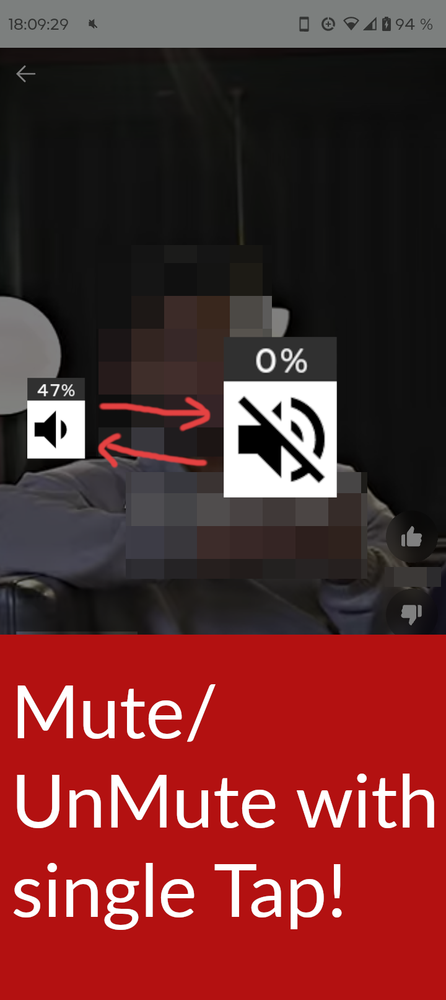

    

<h1 align="center">Floating Mute</h1>

    Easily switch between mute and unmute with a single tap while watching videos. Perfect for YouTube shorts, Reels, and more.

    Made for Android.

    

## Features
- Mute/Unmute your device with a single tap.
- When unmuting it restores the volume as it was before unmuting.
- Can be placed anywhere on the screen by simply dragging it.
- You can hide it by long pressing it, and tap on the notification to make it appear again.
- It saves the position of the button on the screen for each orientations, portrait and landscape.
- Automatically adjusts itself as you change the volume.
- Shows the percentage in beside the floating button.

## Screenshots

<table>
    <tr>
        <td>
            
            
            
            
        </td>
    </tr>
</table>
