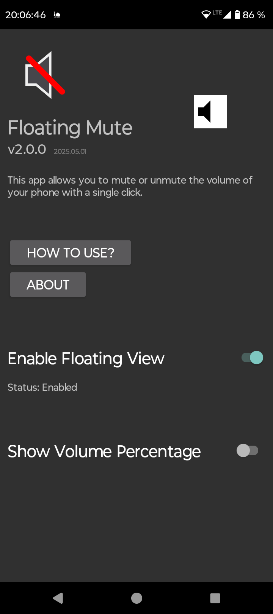

    
    <h1>Floating Mute</h1>
    

        Easily switch between mute and unmute with a single tap while watching videos. Perfect for YouTube shorts, Reels, and more.
    

    

        Made for Android.
    

## Features
- Mute/Unmute your device with a single tap.
- By unmuting it restores the volume as it was before unmuting.
- Can be place anywhere on the screen by simply draging it.
- You can hide it by long pressing it, and tap on the notification to make it appear again.
- It saves the position of the button on the screen seperate for the orientations, portrait and landscape.
- Automatically adjust as you change the volume.
- Shows the percentage in beside the floating button.

## Screenshots

<table>
    <tr>
        <td>
            
            
            
            
            
            
            
        </td>
    </tr>
</table>
